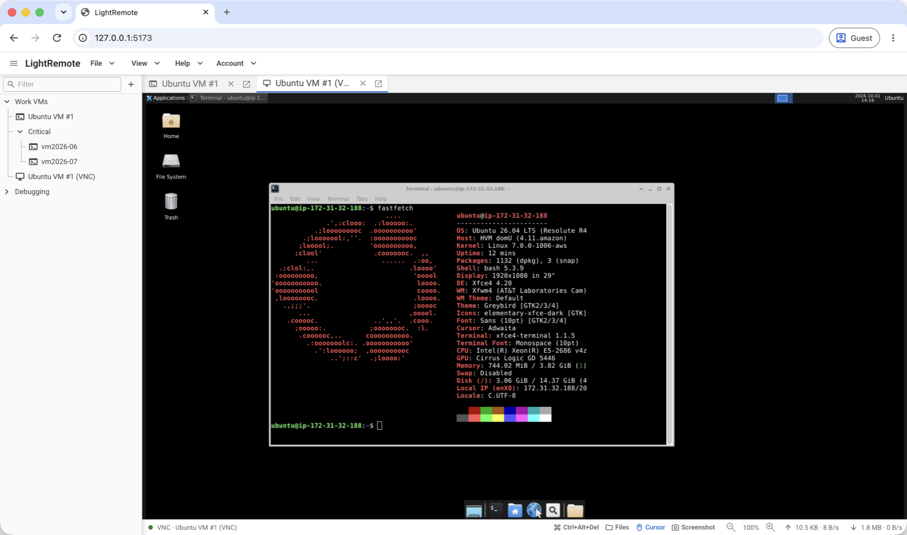

# LightRemote

[](https://github.com/AkmalFairuz/lightremote/actions/workflows/desktop-build.yml)
[](https://github.com/AkmalFairuz/lightremote/actions/workflows/docker-build.yml)

LightRemote brings SSH terminals, VNC desktops, and SFTP, FTP, and explicit FTPS
file management into one browser and desktop workspace, with TightVNC and
UltraVNC file transfer support. Work across tabbed
sessions and detachable windows, organize saved connections, manage reusable
SSH keys, and connect through HTTP, HTTPS, or SOCKS5 proxies. Saved credentials
are encrypted at rest. Built with Go and React. See the [documentation](docs/index.md).

<p align="center">
  <a href="docs/images/screenshot-vnc-desktop.png"></a>
</p>

# Get Started

## Web browser

**Install with Docker:**

```sh
docker run -d \
  --name lightremote \
  --restart unless-stopped \
  -p 8080:8080 \
  -v lightremote-data:/data \
  ghcr.io/akmalfairuz/lightremote:latest
```

Open [http://127.0.0.1:8080](http://127.0.0.1:8080) and create the first admin
account.

## Desktop

Download the latest release for your OS and architecture:

[](https://github.com/AkmalFairuz/lightremote/releases/latest/download/lightremote-macos-amd64.dmg)
[](https://github.com/AkmalFairuz/lightremote/releases/latest/download/lightremote-macos-arm64.dmg)
[](https://github.com/AkmalFairuz/lightremote/releases/latest/download/lightremote-windows-amd64.tar.gz)
[](https://github.com/AkmalFairuz/lightremote/releases/latest/download/lightremote-windows-arm64.tar.gz)
[](https://github.com/AkmalFairuz/lightremote/releases/latest/download/lightremote-linux-amd64.tar.gz)
[](https://github.com/AkmalFairuz/lightremote/releases/latest/download/lightremote-linux-arm64.tar.gz)

# Features

- **SSH terminals:** Password and private key authentication, zoom, and shell
  continuity when moving between windows.
- **VNC desktops:** Remote keyboard and mouse control, read-only modes,
  screenshots, cursor controls, and per-tab zoom.
- **Remote file management:** Browse, upload, download, rename, and edit files
  over SFTP, FTP, and explicit FTPS, with drag-and-drop uploads and transfer progress.
- **VNC file transfer:** Integrated TightVNC and UltraVNC file browsing and transfers.
- **Flexible workspace:** Reorder tabs, detach them into separate windows,
  and resize the sidebar and VNC file panel.
- **Connection folders:** Organize connections in nested folders, rename them
  inline, and drag and drop to reorder or move entries.
- **Connection management:** Search connections with keyboard shortcuts,
  reopen recent connections, duplicate saved entries, and open temporary direct connections.
- **Appearance:** Light, dark, and system themes, plus terminal color palettes
  with saved appearance preferences.
- **Live status:** Connection status, traffic counters, and transfer speeds
  in the workspace status bar.
- **SSH key management:** Import, generate, and reuse keys across connections.
- **Proxy support:** Connect through HTTP, HTTPS, and SOCKS5 proxies.
- **Credential protection:** Encrypt saved credentials at rest and verify SSH
  host fingerprints before connecting.
- **Browser and desktop:** Self-host with Docker or run locally on macOS,
  Windows, and Linux, with amd64 and arm64 builds.
- **Accounts and storage:** Admin and user roles, account-owned connections,
  SQLite or MySQL server storage, and local SQLite storage for desktop use.
