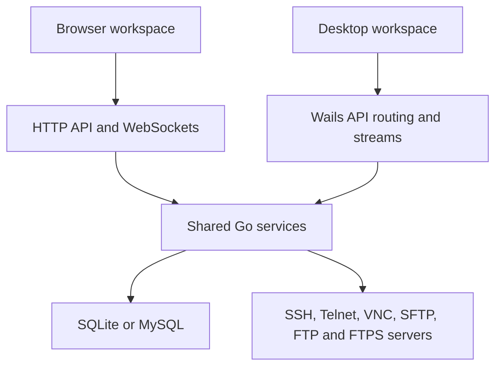

# Architecture

LightRemote separates saved connection management, live viewer sessions, and
remote file operations. A shared Go runtime serves both the standalone HTTP
server and the Wails desktop app.

## Entry points and startup

| Entry point | Behavior |
| --- | --- |
| [`cmd/lightremote/main.go`](../cmd/lightremote/main.go) | Loads server configuration, runs migrations or starts the HTTP server |
| [`main.go`](../main.go) | Starts Wails, bundles the frontend, and routes API requests in process |
| [`internal/bootstrap/runtime.go`](../internal/bootstrap/runtime.go) | Opens storage and assembles services, handlers, and work sessions |

Shared startup opens the selected database, applies schema migrations, creates
the credential vault, and migrates legacy SSH keys. Account mode bootstraps an
administrator when an initial password is configured, otherwise it exposes
first-run browser installation, and cleans expired login sessions hourly.
Local mode provisions a stable internal owner and generates a process-scoped
CSRF token.

The standalone server handles termination signals and gives HTTP shutdown ten
seconds. Desktop shutdown cancels its runtime context and closes the local
user's work sessions and database.

## Backend layers

| Package | Responsibility |
| --- | --- |
| `internal/httpapi` | Chi routing, authentication middleware, JSON validation, API handlers, and viewer transports |
| `internal/connections` | Saved and direct connections, validation, encrypted secrets, host trust, and metadata cache |
| `internal/folders` | Owner-scoped folders, cycle prevention, and a maximum nesting depth of 16 |
| `internal/sshkeys` | Reusable encrypted SSH keys, generation, and legacy key migration |
| `internal/security` | Argon2id passwords, AES-GCM vault, login sessions, and local identity |
| `internal/store` | SQLx repositories for SQLite and MySQL |
| `internal/store/migrations` | Ordered schema changes and engine-specific migration locking |
| `internal/work` | Process-local work reservations, viewer handoff, terminal sessions, replay, and traffic counters |
| `internal/remote` | Outbound dialing, proxies, SSH/Telnet/SFTP/FTP, RFB bridging, and VNC file protocols |
| `internal/desktop` | Wails stream adapter for the shared viewer interface |
| `internal/desktopdata` | Desktop SQLite location and persistent vault key |
| `internal/model` | Shared connection, folder, user, secret, and file data shapes |

## Request flows

### Saved connections

The React API client sends a same-origin request with the current account
bearer session token and CSRF token. Middleware establishes the owner. A handler
validates the request and calls its service. The service checks ownership and settings,
encrypts supplied secrets, and writes through a repository. Responses expose
connection metadata and proxy settings while hiding passwords and private keys.

The UI can also create a direct connection through `/api/direct-connections`.
Its encrypted credentials and connection metadata stay in process memory.
Direct connections use the same host-trust, viewer, and file routes as saved
connections. See [temporary state](storage.md#temporary-state).

### SSH, Telnet and VNC viewers

1. Reserve a work session with `POST /api/connections/{connectionID}/sessions`.
2. Attach the browser to `/api/sessions/{sessionID}/ws`, or attach a native Wails
   stream in desktop mode.
3. Resolve the owned connection and decrypt its credentials in the backend.
4. Start or reuse the remote terminal or VNC bridge and forward viewer traffic.

The session reservation does not establish the upstream connection. Viewer
attachment performs that work. Each session has one active viewer. A new
attachment closes the previous viewer and waits up to five seconds for release.

SSH and Telnet use persistent terminals with bounded output replay. The frontend
detachment workflow preserves that session. VNC detachment creates a fresh work
session and upstream connection. The frontend renders terminal bytes through xterm.js
and framebuffer data through noVNC. See [protocols](protocols.md).

### Remote files

File requests resolve an owned connection and use a `FileClient` implementation.
SFTP and FTP open a short-lived client for each request. VNC reuses an active
desktop bridge's file channel, or opens a headless connection for the operation.
An attached VNC viewer whose file channel is still starting returns
`session_starting` with HTTP 409.

Uploads and downloads stream through the backend. Directory listing and file
mutations use normal API requests. The desktop save service calls the same
authorized download logic and writes to a native file destination.

## State ownership

The database stores accounts, login sessions, folders, saved connections,
recent-open timestamps, encrypted credentials, SSH fingerprints, and reusable
SSH keys. Work sessions, direct connections, and the connection metadata cache
live in the backend process.

Redux holds authentication and temporary workspace state. RTK Query caches API
resources. File directory results have a separate browser memory cache.
Browser storage keeps appearance preferences, sidebar ordering, and detached
window coordination records. Viewer sockets and renderer instances stay in
component refs. See [frontend](frontend.md) and [storage](storage.md).

## API contract

The [OpenAPI specification](../api/openapi.json) describes the REST resources,
file routes, direct connections, and viewer endpoint. The current
[router](../internal/httpapi/router.go) also registers these routes that are
absent from the specification:

- `GET /api/connections/recent`
- `POST /api/connections/{connectionID}/recent`
- `GET` and `POST /api/ssh-keys`
- `POST /api/ssh-keys/generate`
- `PATCH` and `DELETE /api/ssh-keys/{keyID}`

Consult the router, handlers, and frontend types for those interfaces. API
errors use an envelope such as
`{"error":{"code":"not_found","message":"connection not found"}}`.
JSON handlers reject unknown fields, extra JSON values, and bodies over 1 MiB.
File upload bodies have the separate configured limit.
